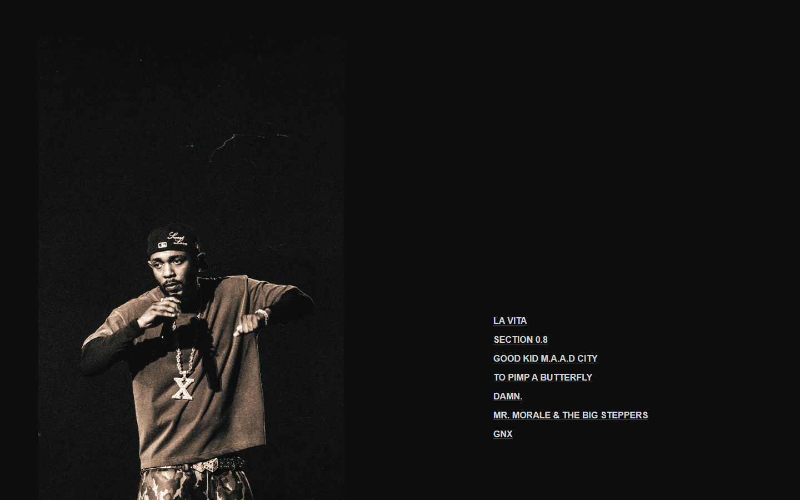
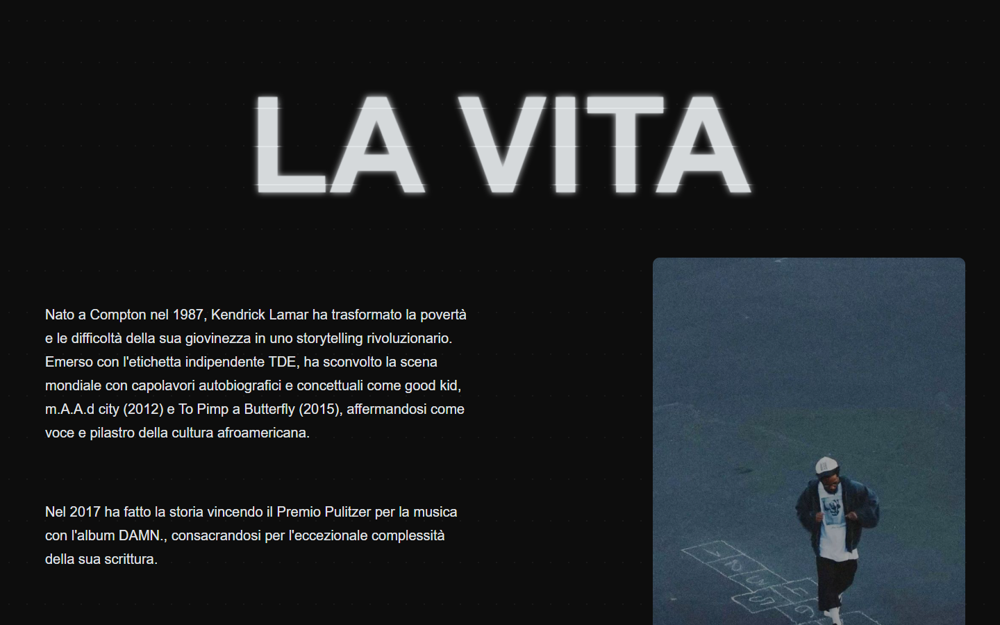
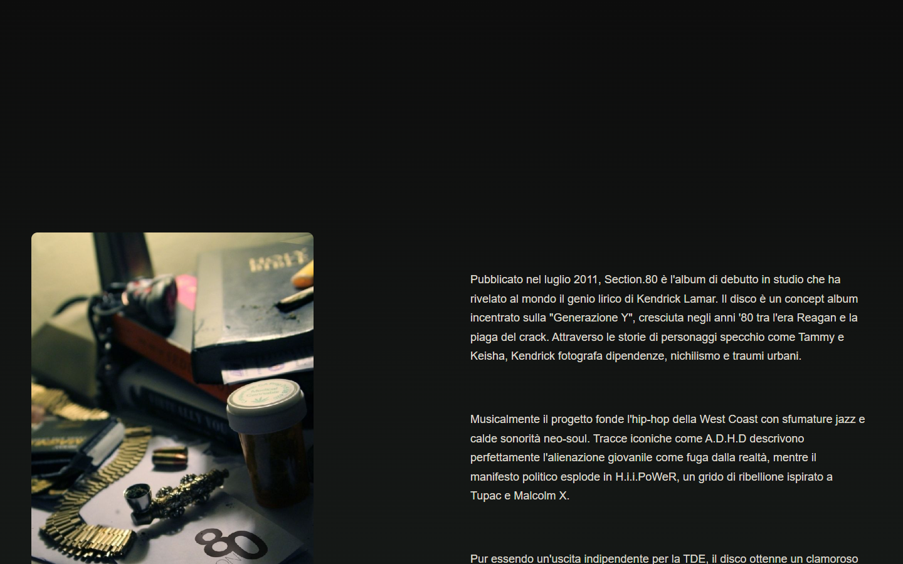
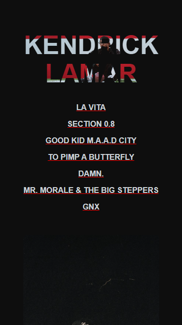

# Kendrick Lamar - Progetto Finale
Un sito web interattivo, responsive e moderno dedicato al leggendario rapper di Compton, Kendrick Lamar.

## Indice
1. [Descrizione del Progetto](#descrizione-del-progetto)
2. [Documentazione Descrittiva](#documentazione-descrittiva)
3. [Documentazione Tecnica](#documentazione-tecnica)
4. [Struttura dei File](#struttura-dei-file)
5. [Screenshot](#screenshot)

---

## Descrizione del Progetto
Questo sito è un tributo a Kendrick Lamar, strutturato per raccontare le sue origini e le sue principali opere musicali. L'interfaccia si propone di essere visivamente accattivante ed elegante, con un forte focus sulla leggibilità e sull'utilizzo dello spazio.

### Documentazione Descrittiva
- **Obiettivo**: Celebrare l'evoluzione artistica di Kendrick Lamar offrendo una navigazione fluida tra le ere principali dei suoi album.
- **Hero Section**: Appena si apre la pagina, si viene accolti da un titolo maschera (*masking text*) che contiene una grafica dinamica al suo interno. Sotto, vi è una navigazione intuitiva (`LA VITA`, `SECTION 0.8`, `GOOD KID M.A.A.D CITY`, ecc.).
- **Sezioni Tematiche**: Ogni sezione (es. *La Vita*, *Section 0.8*) espone la storia e le tematiche fondamentali dell'album relativo, accompagnate dalla copertina o da foto rilevanti disposte secondo pattern bilanciati (Testo a destra/sinistra).
- **Multimedia**: Oltre a immagini di alta qualità, sono presenti player integrati (es. Spotify per ascoltare tracce iconiche come *A.D.H.D*).

---

## Documentazione Tecnica
Il sito è sviluppato usando esclusivamente **HTML5** e **CSS3**, mantenendo un'architettura leggera senza l'uso di framework JavaScript o CSS esterni (es. Bootstrap o Tailwind).

### Scelte di Layout e UI/UX
- **Mobile First e Responsive Design**: Le Media Queries (`@media`) in CSS garantiscono l'adattabilità a tutti gli schermi (Desktop, Tablet/iPad Pro, Smartphone). I breakpoint principali sono definiti a `992px` e `768px`.
- **Flexbox**: Molteplici sezioni sono costruite su container flessibili (`display: flex`). Ad esempio, la griglia per disporre testo e immagine affiancati in modo ottimizzato.
- **Tipografia Dinamica**: Uso intenso di `clamp()` per assicurare che titoli e testi (come `.masked-text`) abbiano un ridimensionamento fluido indipendentemente dai pixel o dai vw isolati. In particolare, è stato applicato il calcolo proporzionato rispetto al contenitore flex per prevenire rotture o scroll orizzontali in layout come l'iPad Pro (1024px).
- **CSS Animations & Effects**: 
  - *Text Masking* (`background-clip: text` e animazione `background-position`) per dare vita al titolo.
  - Testo fluttuante e *reveal animations* su titoli di sezioni sfruttando percorsi di clip-path animati in keyframes.

### Classi Principali

| Classe | File CSS | Descrizione |
|---|---|---|
| `.hero` | `prima.css` | Contenitore principale della prima visuale (100vh), gestisce l'allineamento tramite flexbox in row e column su mobile. |
| `.masked-text` | `prima.css` | Effetto speciale del testo "KENDRICK LAMAR", usa un'immagine di background che viene "mascherata" ai contorni del testo. |
| `.contenitore-layout` | `seconda.css` | Utility class flessibile usata per impostare rapidamente blocchi di testo a fianco di immagini in modo responsivo. |
| `.jt` | `seconda.css` | Gestione per il testo in stile artistico diviso in sezioni tramite `clip-path` animate. |
| `.section-08` | `terza.css` | Stili unici per la presentazione di Section.80, incluso uno sfondo gradiente scuro dedicato. |

---

## Struttura dei File

La struttura si divide logicamente per promuovere la modularità del codice CSS e della gestione degli asset.

| Percorso | Tipo | Descrizione |
|---|---|---|
| `Kendrick-Lamar.html` | Entry point | Il file HTML principale che organizza tutta la struttura semantica del sito. |
| `style/style.css` | Regole globali | Importa tutti i fogli di stile (tramite `@import`) e definisce resettaggi globali (`body`, `font-family`, ecc). |
| `style/*.css` | Stili modulari | I fogli CSS (prima, seconda, terza...) sono organizzati progressivamente per incapsulare stili di sezioni logiche del layout. |
| `img/` | Assets | Contiene le fotografie, cover degli album, loghi e tutto il comparto visuale del sito. |

---

## Screenshot

Navigazione eseguita su `http://127.0.0.1:5500/Kendrick-Lamar.html`

### Desktop Layout

### Mobile Layout

*(Tutti gli screenshot sono stati registrati e resi disponibili interattivamente simulando le diverse viewport)*
